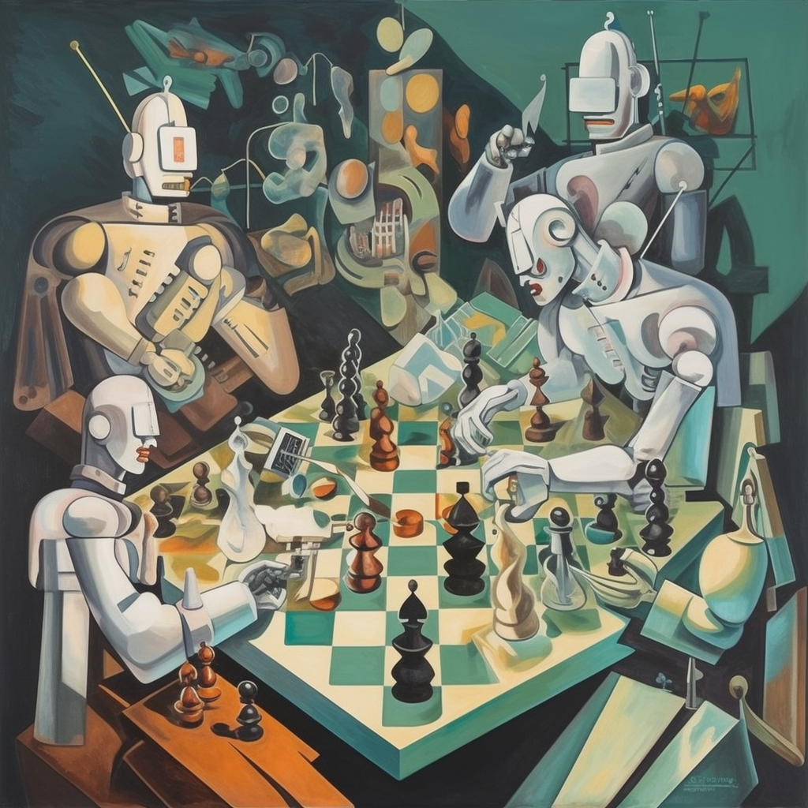

Markov Chains[^1] are a powerful tool for modelling stochastic processes. They are widely used in various fields, from economics to genetics, and from computer science to artificial intelligence (AI)[^2].

A Markov chain is a mathematical system that models a randomly changing process, such as the stock market or the weather. It consists of a set of states (nodes) and transitions (edges) between them. In a Markov chain, the probability of transitioning from one state to another is determined by the current state, and not by any previous states. This is known as the Markov property.

In recent years, the concept of agency has become increasingly important in the field of AI safety. Agency is a measure of the degree to which an AI system is able to act autonomously and make decisions independently from external influences. In this article, we will explore the implications of the Markov property for agency in Markov Chains.
<!-- more -->
# Markov Property

The Markov property is the key to understanding Markov Chains. It states that the probability of transitioning from one state to another is determined only by the current state, and not by any previous states.

Mathematically, this can be expressed as follows:

$$P(X_t|X_{t-1},X_{t-2},\ldots,X_0) = P(X_t|X_{t-1})$$

This equation states that the probability of transitioning from the current state $X_t$ to the next state $X_{t+1}$ is determined only by the current state $X_t$, and not by any of the previous states $X_{t-1},X_{t-2},\ldots,X_0$. This is known as the Markov property.

# Implications for Agency

The implications of the Markov property for agency can be seen in the following example. Consider a Markov Chain with two states $S_1$ and $S_2$. The transition between these two states is governed by the following transition matrix:

$$
P = \begin{pmatrix}
0.9 & 0.1 \\\\
0.1 & 0.9
\end{pmatrix}
$$

This transition matrix states that the probability of transitioning from $S_1$ to $S_2$ is 0.1, and the probability of transitioning from $S_2$ to $S_1$ is 0.9.

Now, consider an AI system that is in the state $S_1$. According to the Markov property, the probability of transitioning to $S_2$ is 0.1. This means that, regardless of the AI system's past behavior, it has a 0.1 chance of transitioning to $S_2$. This is an example of the lack of agency that the Markov property implies.

# Conclusion

In this article, we have explored the implications of the Markov property for agency in Markov Chains. We have seen that the Markov property implies a lack of agency, as the probability of transitioning from one state to another is determined only by the current state, and not by any previous states. This has implications for the safety of AI systems, as it means that they may not be able to make autonomous decisions.

It is important to consider the implications of the Markov property when designing AI systems. Understanding the implications of this property can help to ensure that AI systems are safe and able to make autonomous decisions.

# Other examples of markup

Link to a post: [Agency in Markov Chains](/posts/contingency) (normal MD link)

$$
S(\omega) 
= \frac{\alpha g^2}{\omega^5} e^{[ -0.74\bigl\{\frac{\omega U_\omega 19.5}{g}\bigr\}^{\!-4}\,]}
= \frac{\alpha g^2}{\omega^5} \exp\Bigl[ -0.74\Bigl\{\frac{\omega U_\omega 19.5}{g}\Bigr\}^{\!-4}\,\Bigr] 
$$

The formula

$$F[Q,y]\equiv D_x(Q(x)||P(y,x))=\mathbb{E}_{x\sim Q}(\ln Q(x)-\ln P(y,x))$$

defines the *free energy* $F[Q,y]$.

Lorem ipsum dolor sit amet, consectetur adipiscing elit. Pellentesque hendrerit lacus ut purus iaculis feugiat. Sed nec tempor elit, quis aliquam neque. Curabitur sed diam eget dolor fermentum semper at eu lorem.

``` typescript
import rehypeHighlight from "rehype-highlight/lib";
import rehypeKatex from "rehype-katex";
import rehypeStringify from "rehype-stringify";
import remarkBehead from "remark-behead";
import remarkDirective from "remark-directive";
import remarkGfm from "remark-gfm";
import remarkMath from "remark-math";
import remarkParse from "remark-parse";
import remarkRehype from "remark-rehype";
import { unified } from "unified";

export function markdownToHtml(md: string, minDepth: number = 2): string {
  return unified()
    .use(remarkParse)
    .use(remarkBehead, { minDepth: minDepth } as any)
    .use(remarkMath)
    .use(remarkDirective)
    .use(remarkGfm)
    .use(remarkRehype)
    .use(rehypeKatex)
    .use(rehypeHighlight)
    .use(rehypeStringify)
    .processSync(md)
    .toString();
}
```

[^1]: A Markov chain or Markov process is a stochastic model describing a sequence of possible events in which the probability of each event depends only on the state attained in the previous event. See [Wikipedia](https://en.wikipedia.org/wiki/Markov_chain) for more details.

[^2]: This is just another footnote trying to answer the question: Can we nest footnotes?[^4]

[^4]: Appear so! Also the displayed numbers seem to be automatic!